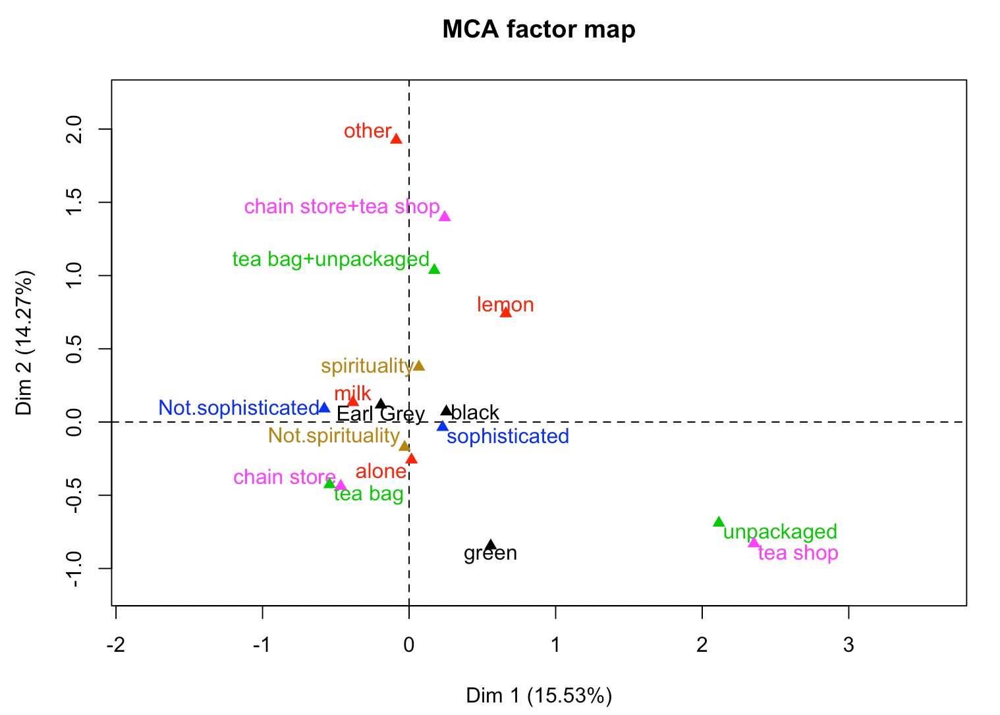

# Week 5: Dimensionality reduction techniques

```{r}
date()
```

<br /> 

## 1 Graphical overview and summaries of variables (3p)

<br /> The data includes 155 observations and the following 8 variables related to human development globally: 

* GNI: Gross National Income per capita 
* LEB: Life expectancy  at birth
* EYE: Expected years of schooling
* MMR: Maternal mortality ratio
* ABR: Adolescent birth rate
* PRP: Proportion of female representatives in parliament
* edu2R: Ratio between females and males with at least secondary education (if > 1, larger portion of female are educated than men)
* labR: Ratio between females and males in the labour force (if > 1, larger portion of female are part of labour force than men)

<br /> I will start by reading the data and looking at the graphical overview and summary of the variables:

```{r,fig.dim= c(8,6)}
library(dplyr)
library(ggplot2)
library(GGally)
library(tidyr)
#library(boot)
library(corrplot)
library(FactoMineR)

# load the data
human <- read.csv("data/human.csv", header = TRUE, stringsAsFactors = TRUE, row.names = 1)

# summaries of the variables
summary(human)

# graphical overview with 
p <- ggpairs(human, lower = list(combo = wrap("facethist", bins = 20)))
p

```

Few observations from the data overview:

* Starting from the first variable, there is a peak at around value 1, which indicated that there is no large difference in the portion of girls being educated vs. boys. However, there is another bumb in the graph somewhere around 0.4 --- this means that there are countries where notably larger share of boys are educated compared to girls. This ratio also seems to have a significant, strong correlation with life expectancy and expected years of schooling (not surprisingly), and a strong negative correlation with maternal mortality. 
* Life expectancy at birth peaks around 70 years but there are still many countries with life expectancy around 60 years or so. There is a major positive correlation between it and expected years of education, and negative correlation with maternal mortality and adolescent birth rate.
* Adolescent birth rate and maternal mortality correlate strongly as well --- when having children as an adolescent, the risks of giving birth are major. In general maternal mortality rate has very low values, which can be explained with the generally high quality of health care and maternal care in the world today.
* Gross national income has quite a large variance, and no clear peak. It has some slightly positive correlation with life expectancy at birth and ratio of female vs male that are educated, but the significance is not strong.

<br />
These same observations can be made also from the correlation matrix presented below.


```{r,fig.dim= c(8,6)}
#plotting the correlation matrix
cor_matrix <- cor(human) %>% round(digits = 2)

corrplot(cor_matrix, method="circle", type="upper", cl.pos="b", tl.pos="d", tl.cex = 0.6)

```


<br /> 

## 2 PCA analysis (2p)

<br /> Doing a PCA analysis on the data:

```{r,fig.dim= c(10,8)}
pca_human <- prcomp(human)

# making a summary of the PCA 
s <- summary(pca_human)

# printing rounded percentages of variance captured by each principal component
pca_pr <- round(100*s$importance[2, ], digits = 1)
pca_pr
# making the lables include the percentages
pc_lab <- paste0(names(pca_pr), " (", pca_pr, "%)")

# draw a biplot
biplot(pca_human, cex = c(0.8, 1),
       col = c("cornsilk4", "darkgoldenrod"),
       xlab = pc_lab[1],
       ylab = pc_lab[2])

```

PCA biplot of human development data shows the first two principal components, that together cover 98% of variation in the data. Gross National Income has mostly effect on the PC2 and maternal mortality rate is the strongest contributor to the PC1. The other variables have a very small eigenvalues (the vectors). 

<br /> 

## 3 Standartizing the variables & PCA (4p)

Next the variables will be standardized and the same PCA analysis done again.

```{r,fig.dim= c(10,8)}
human_std <- scale(human)
pca_human_std <- prcomp(human_std)

# making a summary of the PCA 
s_ <- summary(pca_human_std)

# printing rounded percentages of variance captured by each principal component
pca_pr_ <- round(100*s_$importance[2, ], digits = 1)
pca_pr_
# making the lables include the percentages
pc_lab_ <- paste0(names(pca_pr_), " (", pca_pr_, "%)")

# draw a biplot
biplot(pca_human_std,
       cex = c(0.8, 1),
       col = c("cornsilk4", "darkgoldenrod"),
       xlab = pc_lab_[1],
       ylab = pc_lab_[2])


```

The results are looking quite different. Standardizing brings all the observations to the same range, and therefore it is easier to see the differences and correlations between them, and their ifluence on the principal components. PCA biplot of scaled human development data shows the first two principal components that explain together approximately 64 % of the total variation in the data. After standardizing there are more principal components with some effects (shown in the percentages above the graph) than without standardizing. In general it doesn't really make sense to analyse the results of non-standardised PCA.

<br />

## 4 Interpretation (2p)

The arrows pointing to the same direction as the principal component axis represent the features contributing to that PC. Then again the arrows having a small angle between their directions are strongly correlated with each other. The length of the arrow tells about the standard deviation of the variable --- longer arrow, higher standard deviation. 

Therefore features defining the **first principal component** are expected years of education, ratio between women and men having secondary education, life expectancy at birth and Gross National Income --- that all are rather highly correlated with each other --- as well as maternal mortality ratio and adolescent birth rate, that are strongly correlated with each other as well. These features pointing to opposite directions also correlate with each other, but negatively. In conclution PC1 tells about level of education and giving birth.

The **second principal component** is mostly defined by proportion of females in parliament and ratio of female vs male in labour force, aka it tells something about equality in worklife.

Then we can look at the principal components together and in relation to the observations (Countries). The lower half of the graph shows countries with less women in power, and the upper half more. The left hand countries have a high life expectancy and good level on education, and the right hand side countries are not as developed education- or maternity-wise. Following from this, the countries with high education levels and high ratio of women in parliament are located in the upper left part of the graph and can be thought as the most developed, based on these indicators. At the opposite end of the graph, lower right, there are countries with high maternal mortality rates, higher adolescent birth rate and less women in power. These countries can be said to be the least developed.

This analysis complements the descriptive analysis done based on the correlation matrix, and offers more insight to the data --- PCA analysis helps in seeing overarching themes rising from the data.

<br />

## 5 MCA on tea data (4p)

Checking on the tea data and Multiple Correspondence Analysis on the data:

```{r,fig.dim= c(8,6)}
data(tea)

str(tea)
dim(tea) # observations 300, variables 36

# selecting the following columns to keep for the analysis 
keep_columns <- c("Tea", "How", "how", "sophisticated", "where", "spirituality")

# creating the new dataset based on the wanted variables
#FOR SOME REASON THIS PART IS CRASHING WHEN I KNIT THE index FILE, BUT WORKS IF I ONLY KNIT chapter5 FILE...

#tea_time <- select(tea, one_of(keep_columns))

#MCA on the data
#mca <- MCA(tea_time, graph = FALSE)

#making a plot about the results
#plot(mca, invisible=c("ind"), habillage = "quali", graph.type = "classic")

```

Since I had problems with running the index file even though the scripts works well when kinning only chapter5 file, I will attach a picture of the results instead:





From the visualization we can see that using tea bags for making the tea goes hand in hand with buying the tea from a chain store, and similarly using unpacked tea and shopping in specific tea shops are very close. These make a lot of sense since most loose-leaf teas are sold in tea shops. 

Black tea is close to sophisticated and milk usage rather close to not-sophisticated. Green tea and using lemon both stand out from the other variables. 

These are maybe not the most interesting variables for the Multiple Correspondence analysis, and some others could have been chosen instead.


<br /> **END OF WEEK 5!**
<br />
